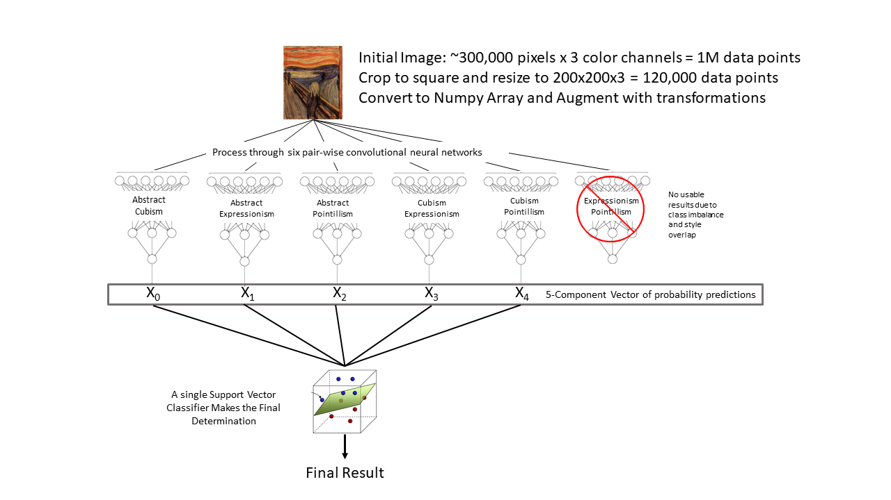
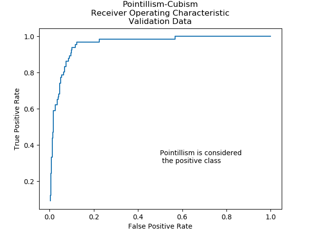
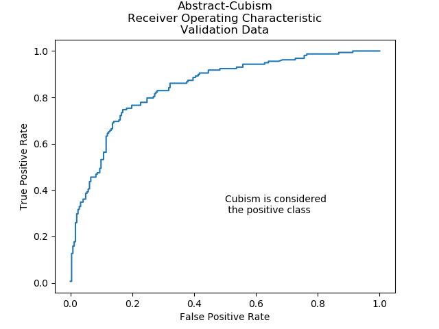
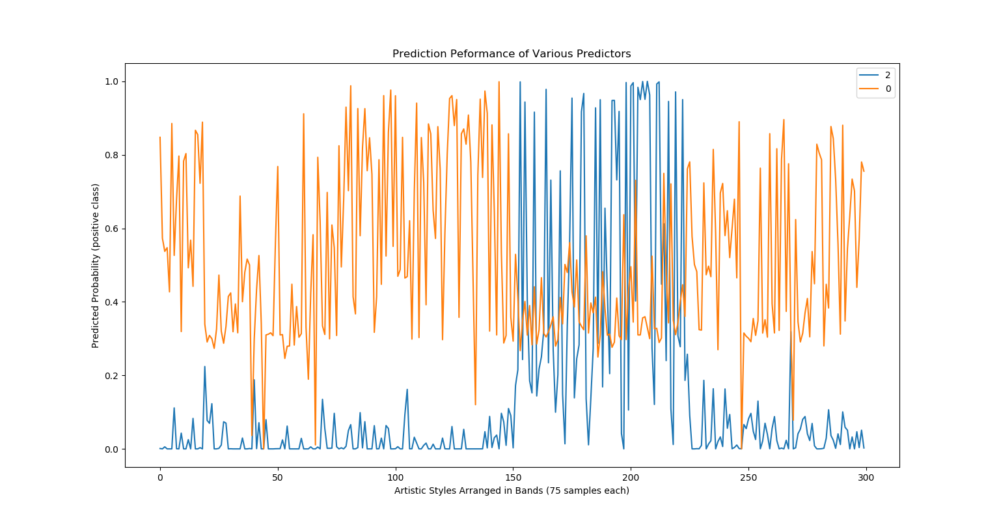
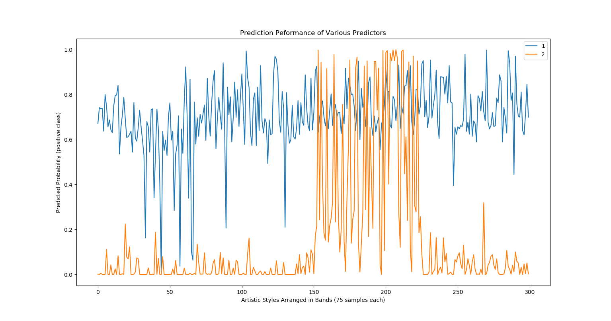
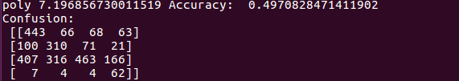
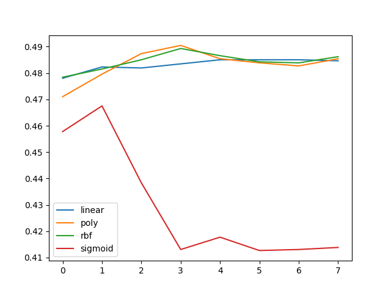

# UNDER CONSTRUCTION

# Visit Art Guesser
[Visit the Art Guesser app](http://belenky.land "Art Guesser")

# Art Guesser
by Land Belenky  
www.belenky.name  
land@belenky.name  
github.com/ljbelenky  

## Introduction

This is my capstone project for the Galavanize Data Science Immersive (DSI) program in Denver, Colorado. It was completed over a two week period in January of 2018 and still needs a bit of clean-up and refinement.

As an engineer and scientist, I know very little about fine art. I'd like to know more, but sometimes I get intimidated by what I don't know, or if I go to an art museum and see a painting I don't like, it can leave me disappointed and feeling isolated from art. So I decided that one way to learn more about art is to get better at understanding the styles of art, so I can get a feel for what I like, what I don't like and how to navigate between them.

I thought it would be interesting to use Machine Learning (ML) to teach a computer to recognize the style of fine art.

There are many different methods of machine learning, but mostly they follow the same basic pattern:  Given a set of input values, and a set of desired output values, we want to construct an algorithm that does the best job of calculating the desired output value for any set of input values. In our case, the input values are the numeric values corresponding to the red, green and blue values for every pixel in an image. The desired output values are a number between 0 and 1, where numbers close to zero indicate that the painting is of style zero and numbers close to one indicate that the painting is of style 1.

Many problems in Machine Learning can at least approximately be solved by linear regression of the input values. For example, if you're trying to calculate the sales price of a house (the output value), it's pretty easy to see that it's positively related to some factors (number of bedrooms, total sq feet, etc) and negatively related to other factors (age of roof, number of reported poltergeists, etc.)  Each of these factors is assigned a weight, and the weights are adjusted until the difference between the predicated values and the actuals values is as small as it can be. Eventually, you have a model in which each feature has predictable effect on the overall output value. For example, you can make a statement such as "all factors being equal, the addition of one extra square foot to the size of a house results in an increase of about $100 of sales price."

These methods are totally ineffective for image classification. It's impossible to point to any pixel value in an image and say "the value of that pixel indicates this is a Cubist painting... and the brighter that pixel, the more certain I am that it is Cubist!" Image classification requires a whole new approach, and particularly a non-linear approach in which parts of the image have no fixed impact on the eventual classification. We call these Convolutional Neural Networks (CNNs).

CNNs work by building a set of "filters" which is an array of numeric values. These filters are convolved or passed across the image. This may be done in multiple layers and with multiple images. The end result then is not a mere tallying of pixel values, but rather an assessment of a collection of features. When we find a group of features that seems to correspond to one class more than another, we can develop an algorithm based upon this difference.

CNNs can be very complicated and some can be so good at some tasks (like recognizing faces and objects) that they appear to be almost magical. But it's important to remember that they are nothing more than computer algorithms that take in a bunch of numbers, do some calculations, and spit out a number. Keeping this in mind, and wanting to see how CNNs perform in action, one of my goals of this project was to keep the CNNs as simple as possible. I believe I sacrificed some accuracy (and certainly simplicity) in the name of keeping things comprehensible. But this was a learning project, not a production version, so I'm happy with that trade-off.

My goal for this project was to help me learn about the inner workings of CNNs, but in the process, it also helped me gain some insight into the differences in styles of art and learn what I like. I hope it does the same for you..

#### Disclaimer:
The methods and technology presented in this project are not intended to substitute for the judgment and experience of an actual art historian. If you require the services of an art historian, please hang up immediately and contact the Association of Art Historians at www.aah.org.uk

#### Further Disclaimer:
Is this really the best way to solve this problem? Does it make sense to use a round-robin approach and an SVC? Does this scale well? Is it easy to train? Is it robust and extensible?

None of the above. I took this approach because I was interested in building neural networks from the ground up, in being able to watch things break and get them working again. Maybe later I'll work on a more robust approach.

## Methodology

All the programming in this project was done using Python 3. I used BeautifulSoup to webscrape images of paintings from WikiArt.org. I then used the Python Image Library to crop these to squares that are 90% of the minimum of their height and width. These were then resized to 200x200 pixels and converted to RGB color format. That makes each input image an array of 120,000 numbers.  I split these into train, validation and holdout data sets.

I tried a few different styles of neural networks. The one I settled on was adapted from a CNN used to distingusih between pictures of cats and dogs.
https://blog.keras.io/building-powerful-image-classification-models-using-very-little-data.html

Three different general architectures for the neural network were explored. The first and most ambitous was to use a single, large neural network trained simultaneously on nine styles of art. The output of this network was a vector or nine values representing the prediction probability corresponding to each style. In theory, this model provides the greatest flexibility and predictive power, but the enormity of the calculations proved insurmountable in the scope of this project.

Another model that was investigated was a Each-vs-Others structure in which nine separate neural networks are trained on a binary data set. Each data set has one class composed of a single artistic style and the other data set composed of a mixture of all other styles. After each neural network yields a result, we simply pick the one result that shows the highest probability that the work of art is of the independent style. Two advantages of this approach are that the number of neural networks scales as N, the number of artistic styles under consideration and that each style is considered in every neural network (either as the independent style, or part of the mixed group).  Considerable effort was expended in training models of this type, however the mixure of styles present in the 'Others' group presents a large challenge to training. The best results obtained were in the range of 44% accuracy. Considering that random guessing from a choice of 9 categories would yield only 11% accuracy, this result is promising, but far from ideal.

Ultimately, the model that was employed was a Each-vs-Each or round-robin ensemble method. In this apprach, a series of neural networks are trained btween each pair of artistic styles. To predict the style of a painting, it is then passed through all neural networks in the group and the predicted probability of each style is summed from each neural network that was trained on that style. The nerual network clearly performs best when the range of inputs is limited and the categories are homogenous. Some models that are more visually distinct such as the comparison between Cubism and Pointillism were able to train to better than 80% accuracy on validation sets within just a few epochs, provided that both classes are homogenous. The addition of a second, unrelated class to such as a One-vs-Two model greatly increases the training time and reduces the accuracy. One disadvantage to this approach is that the number of neural networks increases as N*(N-1)/2, Order(2), so the consideration of a larger number of styles quickly results in an very large number of neural networks. This is somewhat mitigated by the fact that the new neural networks train relatively quickly and combining them into an existing family of neural networks requires only a simple addition process. Another advantage is that prediction power decreases as the number of styles increases. If we define the 'signal' as the number of neural networks trained on a particular style, and the 'noise' as the number of neural networks trained on two different styles, we see that for a 3-fold family of networks (A-B, A-C, B-C), each style is present in two networks and absent in one, for a signal-to-noise ration of 2:1. In a 4-fold family, (A-B, A-C, A-D, B-C, B-D, C-D), the ratio decreases to parity. For an ensemble for nine styles (36 total neural networks), the ratio is below 1:4. Nevertheless,the speed of training and ease of expanding this ensemble approach makes it suitable for consideration of small sets.

## Results
Reasonable ROC curves obtained for most pairwise comparisons

Accuracies generally above 70% on validation and holdout samples

Not all predictors operate over the same range. Here is a comparison of two predictors trained on the Pointillism class (vs. Abstract and vs. Cubism.) Blue shows large increase during Pointillism band, orange shows moderate reduction.

In this case, the blue predictior is relatively uniform across all four artistic styles, indicating it is not a strong predictor. However, in absolute magnitude, it reports results quite high, especially when compared to orange which is a much better predictor. Therefore, if the values are simply averaged together, the results from the poor predictor can overpower the good predictor, skewing results towards the Expressionism class.

### Final Pooling SVC

## Prospects for the Future
Simple Neural networks can be highly adept at

## References
### Artist Identification with Convolutional Neural Networks
#### Nitin Viswanathan
http://cs231n.stanford.edu/reports/2017/pdfs/406.pdf
## Related Work
In the last few days, the Google Arts and Culture App has gone viral with its ability to match selfies of users to portraits in fine art museusm. Although I hhad the idea for this project before I learned about that project, I am enjoying its popularity because it validates my core assumption which is that people enjoy interacting with art when it comes to them through the channels they already use, rather than hangs stagnant in an art museum.

I have seen a paper that uses an artificial nerual network to identify the style of art based on aggregate metrics such as color distribution, prominence of edges and other defined features. [reference needed]

Some of this project is based on the work of Nitin Viswanathan who developed a neural network to identify the artist of a particular work.

The conversion of art into a different style was inspired by Gatys [citation needed]

The Cats-vs-Dogs CNN of () was used as a template for the Keras portion of this project. [reference needed]
