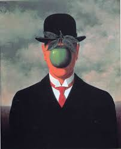

# Art Guesser
ssh -i ~/.ssh/land_kp_app1.pem ubuntu@ec2-34-239-177-77.compute-1.amazonaws.com 

## S3 Bucket
land-capstone-data

## EC2
ec2-54-173-151-200.compute-1.amazonaws.com
ssh -i ~/.ssh/land_kp_app1.pem ubuntu@ec2-54-173-151-200.compute-1.amazonaws.com

### big_iron
ssh -i ~/.ssh/land_kp_app1.pem ubuntu@ec2-34-239-162-106.compute-1.amazonaws.com

scp -i ~/.ssh/land_kp_app1.pem cat_dog.tar.gz ubuntu@ec2-34-239-162-106.compute-1.amazonaws.com:~
scp -i ~/.ssh/land_kp_app1.pem ubuntu@ec2-34-239-162-106.compute-1.amazonaws.com:~/DSI-Capstone/ where/to/put

tar -xvzf community_images.tar.gz

rsync -avz -e 'ssh' data_binary/ ubuntu@ec2-34-239-162-106.compute-1.amazonaws.com

## big guy (p2.xlarge)
ssh -i ~/.ssh/land_kp_app1.pem ubuntu@ec2-34-228-157-37.compute-1.amazonaws.com

## Introduction
Great works for art are not only pretty to look at, but also constitute one of the most important, universal and continuous records of human history. Besides the subject depicted in the he art, paintings are a record of the math and technology used to create them, and the prevailing (and countervailing) culture, religion and politics of the time.

Like societies, art changes through time and can be (more or less) divided into movements of similar styles, clustered together by time, region and political distinctions. Unfortunately, for many of us who are not trained in art history or art appreciation, these movements may seem incomprehensible. Words like "Impressionism," "Expressionism," and "Art Nuveau" can be intimidating for novice viewers, and may form a barrier to enjoying and understanding art.

The goal of this project is to use convolution neural networks and unsupervised machine learning to make the world of art more accessible and inviting for everyone. I have crated an webapp in which a person can upload an image that they enjoy and the computer can then identify its style, and find related works for art from the world's great museums. Additionally, the neural network may be able to recast the art into the style of other artists.

My hope for this project is that it will help people enjoy the art they already know, perhaps gain some insight into what they like and why,  find connections to similar art and become interested in exploring new art.

#### Abstract Art Or Pointillism?

### Content is not the same thing as style
Pre-trained convolutional neural networks can be very adept at identifying objects within images, but this does not necessarily help determine artistic style.
 
For this reason, I decided not to use pre-trained models.

## Methodology
As far a computer can see, an image is nothing more than a collection of numbers, one each for red, green and blue at each pixel in the image. Using traditional methods, we could plot their values or take their means, standard deviations or frequency distributions, but these metrics bear very little correlation to the style of an image.

This project is based on a convolutional neural network for three main reasons.

First, it does not require the developer to manually identify any features. In theory, a model could be built based on identify the backgrounds, foregrounds, and subjects in a painting. We know that Piet Mondrian used thick black lines, Jackson Pollack used dribbles of paint, George Seurat used tiny dots and lots of Renaissance artists painted cherubs. So, identifying those items could be the basis of a classification engine, but even if these steps were automated with machine vision, such a model would struggle to be flexible and thorough. A neural network is self-training. It may determine that a bowl of fruit signifies a still life, but it does not need to be told to look for bowls of fruit.

Second: A convolutional neural network looks for relationships between parts of the image. Knowing the color value of any particular point on an image does nothing to help us identify the style. A convolutional neural network essential scans its gaze across the image and looks for relationships between adjacent (and even distant) pixels.

Third: Non-linear. An apple in an image may indicate that the painting is a still life, but if the apple obscures a man's face, it's a different type of art entirely. Deep Learning neural networks, can make these types of non-linear connections because the output values at one layer are combined and used as the input values at the next layer. In this way, a single object does not have a fixed effect on the eventual output, but rather is considered in context with other inputs and intermediate derived values.

#### Sources
34,000 images from WikiArt.org via BeautifulSoup
#### Overview
#### Pretreatment
Cropped to area of interest, resized to 200x200
#### Train-Test-Validation Split

### Model

#### Overall Architecture

Three different general architectures for the neural network were explored. The first and most ambitous was to use a single, large neural network trained simultaneously on nine styles of art. The output of this network was a vector or nine values representing the prediction probability corresponding to each style. In theory, this model provides the greatest flexibility and predictive power, but the enormity of the calculations proved insurmountable in the scope of this project.

Another model that was investigated was a Each-vs-Others structure in which nine separate neural networks are trained on a binary data set. Each data set has one class composed of a single artistic style and the other data set composed of a mixture of all other styles. After each neural network yields a result, we simply pick the one result that shows the highest probability that the work of art is of the independent style. Two advantages of this approach are that the number of neural networks scales as N, the number of artistic styles under consideration and that each style is considered in every neural network (either as the independent style, or part of the mixed group).  Considerable effort was expended in training models of this type, however the mixure of styles present in the 'Others' group presents a large challenge to training. The best results obtained were in the range of 44% accuracy. Considering that random guessing from a choice of 9 categories would yield only 11% accuracy, this result is promising, but far from ideal.

Ultimately, the model that was employed was a Each-vs-Each or round-robin ensemble method. In this apprach, a series of neural networks are trained btween each pair of artistic styles. To predict the style of a painting, it is then passed through all neural networks in the group and the predicted probability of each style is summed from each neural network that was trained on that style. The nerual network clearly performs best when the range of inputs is limited and the categories are homogenous. Some models that are more visually distinct such as the comparison between Cubism and Pointillism were able to train to better than 80% accuracy on validation sets within just a few epochs, provided that both classes are homogenous. The addition of a second, unrelated class to such as a One-vs-Two model greatly increases the training time and reduces the accuracy. One disadvantage to this approach is that the number of neural networks increases as N*(N-1)/2, Order(2), so the consideration of a larger number of styles quickly results in an very large number of neural networks. This is somewhat mitigated by the fact that the new neural networks train relatively quickly and combining them into an existing family of neural networks requires only a simple addition process. Another advantage is that prediction power decreases as the number of styles increases. If we define the 'signal' as the number of neural networks trained on a particular style, and the 'noise' as the number of neural networks trained on two different styles, we see that for a 3-fold family of networks (A-B, A-C, B-C), each style is present in two networks and absent in one, for a signal-to-noise ration of 2:1. In a 4-fold family, (A-B, A-C, A-D, B-C, B-D, C-D), the ratio decreases to parity. For an ensemble for nine styles (36 total neural networks), the ratio is below 1:4. Nevertheless,the speed of training and ease of expanding this ensemble approach makes it suitable for consideration of small sets.

## Results
Reasonable ROC curves obtained for most pairwise comparisons

Accuracies generally above 70% on validation and holdout samples

Not all predictors operate over the same range. Here is a comparison of two predictors trained on the Pointillism class (vs. Abstract and vs. Cubism.) Blue shows large increase during Pointillism band, orange shows moderate reduction.

In this case, the blue predictior is relatively uniform across all four artistic styles, indicating it is not a strong predictor. However, in absolute magnitude, it reports results quite high, especially when compared to orange which is a much better predictor. Therefore, if the values are simply averaged together, the results from the poor predictor can overpower the good predictor, skewing results towards the Expressionism class.

### Final Pooling SVC

## Prospects for the Future
Simple Neural networks can be highly adept at

## References
### Artist Identification with Convolutional Neural Networks
#### Nitin Viswanathan
http://cs231n.stanford.edu/reports/2017/pdfs/406.pdf
## Related Work
In the last few days, the Google Arts and Culture App has gone viral with its ability to match selfies of users to portraits in fine art museusm. Although I hhad the idea for this project before I learned about that project, I am enjoying its popularity because it validates my core assumption which is that people enjoy interacting with art when it comes to them through the channels they already use, rather than hangs stagnant in an art museum.

I have seen a paper that uses an artificial nerual network to identify the style of art based on aggregate metrics such as color distribution, prominence of edges and other defined features. [reference needed]

Some of this project is based on the work of Nitin Viswanathan who developed a neural network to identify the artist of a particular work.

The conversion of art into a different style was inspired by Gatys [citation needed]

The Cats-vs-Dogs CNN of () was used as a template for the Keras portion of this project. [reference needed]
